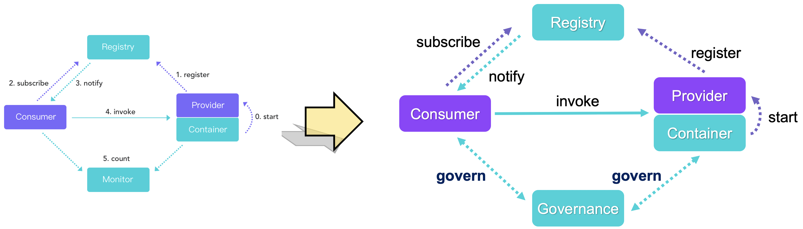
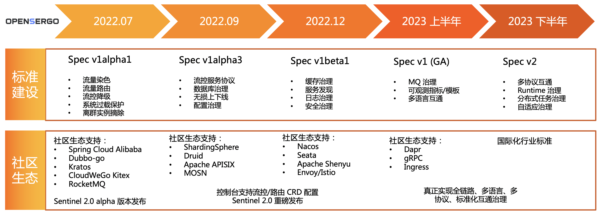

## OpenSergo 是什么

在传统微服务架构中，我们将服务调用中各角色分为四大块：服务提供者、服务消费者、注册中心、监控。随着分布式服务架构的不断演进带来诸多复杂的稳定性与易用性问题，单一的监控已无法满足架构的演进。在现代微服务架构中，我们需要一些手段来对复杂的微服务架构进行“治理”。微服务治理就是通过全链路灰度、无损上下线、流控降级、异常流量调度、数据库治理等技术手段来减少甚至避免发布和管理大规模应用过程中遇到的稳定性问题，对微服务领域中的各个组件进行治理。服务提供者、消费者、注册中心、服务治理，构成现代微服务架构中重要的“四大件”。



在企业内部，往往存在着不同语言、不同通信协议的微服务，这种异构化的架构会导致治理微服务的过程中，业务开发者、架构师无法用统一的方式来对所有服务进行治理管控，并且这类异构会衍生出更多的痛点：

* 业内对服务治理的能力和边界没有明确的认识，每个企业所定义的服务治理概念不一致，造成很高的理解和沟通成本。
* 开源微服务框架众多，对于服务治理缺乏一些标准化的约定。例如，Spring Cloud 中定义的微服务接口和 Dubbo 中定义的接口就没有办法互通，通过 Dubbo 和 Istio 管理的微服务也没有办法进行统一治理。开发者无法通过统一的配置方式来对不同框架、不同语言的服务进行统一治理管控。
* 缺少真正面向业务、能够减轻认知负担的抽象和标准。开发者真正想要的可能是简单的、指定服务间的调用关系和配置规则。但现在对于业务开发者来说，不仅需要了解不同微服务框架的部署架构，也要了解不同服务治理方式的概念和能力区别，认知成本很大。

基于上面这些痛点，阿里巴巴在2022年1月开始和 bilibili、字节等厂商讨论服务治理如何规范化和更加普及，从而共同发起了 [OpenSergo 项目](https://opensergo.io/zh-cn)。OpenSergo 是一套开放、通用的、面向分布式服务架构、覆盖全链路异构化生态的服务治理标准，基于业界服务治理场景与实践形成服务治理通用标准。OpenSergo 的最大特点就是**以统一的一套配置/DSL/协议定义服务治理规则，面向多语言异构化架构，做到全链路生态覆盖**。无论微服务的语言是 Java, Go, Node.js 还是其它语言，无论是标准微服务还是 Mesh 接入，从网关到微服务，从数据库到缓存，从服务注册发现到配置，开发者都可以通过同一套 OpenSergo CRD 标准配置针对每一层进行统一的治理管控，而无需关注各框架、语言的差异点，降低异构化、全链路服务治理管控的复杂度。


OpenSergo 标准基于微服务治理中相关领域的实践与场景抽象，覆盖了服务元信息、流量治理、服务容错、数据库/缓存治理、服务注册发现、配置治理等十几个关键领域，覆盖了完整的微服务生命周期（从开发态到测试态，到发布态，再到运行态）。无论我们是希望针对 Spring Cloud + Dubbo 服务链路配置流量灰度隔离，还是希望针对一个 Go gRPC 服务进行流量控制，还是希望针对服务访问数据库的慢 SQL 调用进行自动熔断，我们都可以利用 OpenSergo spec 中定义的 CRD 标准来进行统一配置，而无需关注各框架不同的声明式 API 及互不兼容的配置格式。


OpenSergo 生态由以下几部分组成：

* [OpenSergo spec](https://github.com/opensergo/opensergo-specification)：统一的服务协议与 CRD 标准定义
* OpenSergo 多语言 SDK：提供统一的标准 CRD 对接模块，供各个框架组件对接 OpenSergo spec
* OpenSergo 数据面：即对接 OpenSergo spec 的框架组件，均可通过 OpenSergo 标准方式进行统一治理
* OpenSergo 控制面：提供统一的控制台来进行服务元信息查询以及流量路由、流量控制等治理规则配置。

我们期望与各个社区进行合作共建，将更多的框架与组件对接到 OpenSergo 生态中，每个框架都是 OpenSergo 的数据面，可以通过 OpenSergo CRD 进行统一治理管控。

那么 OpenSergo 标准到底是什么样子的呢？我们可以利用 OpenSergo 标准来做哪些事情呢？下面我们来结合几个例子来进行介绍。

## OpenSergo 标准介绍

OpenSergo 项目涵盖服务元信息、服务注册发现、流量治理、服务容错、数据库治理、缓存治理等领域。在我们的首个版本 v1alpha1 版本中，我们提供了 服务契约（元数据）、流量路由、流控降级 这几个领域的 CRD 标准。下面我们来介绍一下流量路由与流控降级这两个领域的示例。

### 流量路由

流量路由，顾名思义就是将具有某些属性特征的流量，路由到指定的目标。流量路由是流量治理中重要的一环，我们可以基于流量路由标准来实现各种场景，如全链路灰度、金丝雀发布、容灾路由等。

[流量路由规则(v1alpha1)](https://github.com/opensergo/opensergo-specification/blob/main/specification/zh-Hans/traffic-routing.md) 主要分为三部分：

* Workload 标签规则 (WorkloadLabelRule)：将某一组 workload（如 Kubernetes Deployment, Statefulset 或者一组 pod，或某个 JVM 进程，甚至是一组 DB 实例）打上对应的标签
* 流量标签规则 (TrafficLabelRule)：将具有某些属性特征的流量，打上对应的标签
* 按照 Workload 标签和流量标签来做匹配路由，将带有指定标签的流量路由到匹配的 workload 中

我们以广泛使用的全链路灰度场景为例。全链路灰度通过一系列的流量路由规则，将链路上的多个服务的相同版本划分到同一个泳道中，从而约束流量只在指定泳道中流转，实现全链路的流量隔离的目的。

整个流程可以用下图概括，我们通过通用的 Workload 标签规则与流量标签规则，来以统一的标准方式对完整的服务链路实现灰度的能力。


**给 Workload 打标签**：

我们对新版本进行灰度时，通常会有单独的环境，单独的部署集。我们将单独的部署集打上 gray 标签（标签值可自定义），标签会参与到具体的流量路由中。
我们可以通过直接在 Kubernetes workload 上打 label 的方式进行标签绑定，如在 Deployment 上打上 `traffic.opensergo.io/label: gray` 标签代表灰度。对于一些复杂的 workload 打标场景（如数据库实例、缓存实例标签），我们可以利用 `WorkloadLabelRule` CRD 进行打标。示例：

```yaml
apiVersion: traffic.opensergo.io/v1alpha1
kind: WorkloadLabelRule
metadata:
  name: gray-sts-label-rule
spec:
  workloadLabels: ['gray']
  selector:
    app: my-app-gray
    database: 'foo_db'
```

**给流量打标签**：

假设现在需要将内部测试用户灰度到新版主页，测试用户 uid=12345，UID 位于 `X-User-Id header` 中，那么只需要配置如下 CRD 即可：

```yaml
apiVersion: traffic.opensergo.io/v1alpha1
kind: TrafficLabelRule
metadata:
  name: my-traffic-label-rule
  labels:
    app: my-app
spec:
  selector:
    app: my-app
  trafficLabel: gray
  match:
  - condition: "=="    # 匹配表达式
    type: header       # 匹配属性类型
    key: 'X-User-Id'   # 参数名
    value: 12345       # 参数值
  - condition: "=="
    value: "/index"
    type: path
```

通过上述配置，我们可以将 path 为 `/index`，且 uid header 为 12345 的 HTTP 流量，打上 gray 标，代表这个流量为灰度流量。

**按照标签来路由**：

在具体的路由过程中，接入了 OpenSergo 的微服务框架、Service Mesh 的 proxy 中，只要实现了 OpenSergo 标准并进行上述规则配置，那么就能识别流量的标签和 workload 的标签。带 gray 标签的流量就会流转到 gray 标签的实例分组中；如果集群中没有 gray 实例分组（即没有 workload 带有这个标签），则默认 fallback 到没有标签的实例上。后续版本标准将提供未匹配流量的兜底配置方式。

社区还在不断完善流量路由相关的标准，并与各个社区合作共建，让更多的框架组件支持 OpenSergo 标准，从而支持统一的流量路由管控。

### 流控降级与容错

流控降级与容错同样是服务流量治理中关键的一环，以流量为切入点，通过流控、熔断降级、流量平滑、自适应过载保护等手段来保障服务的稳定性。在 OpenSergo 中，我们结合 [Sentinel](https://sentinelguard.io/) 等框架组件的场景实践对流控降级与容错抽出标准 CRD。一个[容错治理规则](https://github.com/opensergo/opensergo-specification/blob/main/specification/zh-Hans/fault-tolerance.md) (`FaultToleranceRule`) 由以下三部分组成：

* Target: 针对什么样的请求
* Strategy: 容错或控制策略，如流控、熔断、并发控制、自适应过载保护、离群实例摘除等
* FallbackAction: 触发后的 fallback 行为，如返回某个错误或状态码


无论是 Java 还是 Go 还是 Mesh 服务，无论是 HTTP 请求还是 RPC 调用，还是数据库 SQL 访问，我们都可以用这统一的容错治理规则 CRD 来给微服务架构中的每一环配置容错治理，来保障我们服务链路的稳定性。只要微服务框架适配了 OpenSergo，即可通过统一 CRD 的方式来进行流控降级等治理。

以下 YAML CR 示例定义的规则针对 path 为 `/foo` 的 HTTP 请求（用资源名标识）配置了一条流控策略，全局不超过 10 QPS。当策略触发时，被拒绝的请求将根据配置的 fallback 返回 429 状态码，返回信息为 `Blocked by Sentinel`，同时返回 header 中增加一个 header，key 为 `X-Sentinel-Limit`, value 为 foo。

```yaml
apiVersion: fault-tolerance.opensergo.io/v1alpha1
kind: RateLimitStrategy
metadata:
  name: rate-limit-foo
spec:
  metricType: RequestAmount
  limitMode: Global
  threshold: 10
  statDuration: "1s"
---
apiVersion: fault-tolerance.opensergo.io/v1alpha1
kind: HttpRequestFallbackAction
metadata:
  name: fallback-foo
spec:
  behavior: ReturnProvidedResponse
  behaviorDesc:
    # 触发策略控制后，HTTP 请求返回 429 状态码，同时携带指定的内容和 header.
    responseStatusCode: 429
    responseContentBody: "Blocked by Sentinel"
    responseAdditionalHeaders:
      - key: X-Sentinel-Limit
        value: "foo"
---
apiVersion: fault-tolerance.opensergo.io/v1alpha1
kind: FaultToleranceRule
metadata:
  name: my-rule
  namespace: prod
  labels:
    app: my-app # 规则配置生效的应用名
spec:
  targets:
    - targetResourceName: '/foo'
  strategies: 
    - name: rate-limit-foo
  fallbackAction: fallback-foo
```

在近期的 2022 中间件开发者峰会中，我们宣布了 Sentinel 2.0 流量治理的全面升级。Sentinel 2.0 将原生支持流量治理相关 CRD 配置，结合 Sentinel 提供的各框架的适配模块，让 Dubbo, Spring Cloud Alibaba, gRPC 等20+框架能够无缝接入到 OpenSergo 生态中，用统一的 CRD 来配置流量路由、流控降级、服务容错等治理规则。

## 社区规划

让异构微服务能够用统一的服务协议与配置方式进行治理、让更多微服务能够互联互通，塑造更加云原生的微服务，是 OpenSergo 建立之初就树立的长期发展目标。

在标准化建设上，OpenSergo 社区会联合更多开源社区与企业，在数据库治理、缓存治理、服务注册发现、配置治理等更多领域层面上标准化微服务治理能力，让企业能够用一套通用语言来描述和治理自己的微服务架构，让开发者专注于业务核心价值，让微服务框架也能够被客户轻松采用。

在社区生态建设上，OpenSergo 社区将逐渐覆盖从网关、RPC、数据库、缓存到服务发现、服务配置等分布式服务链路中的每一环生态，通过与各社区合作，让各主流框架均可以借助统一的 OpenSergo spec 来定义与实现服务治理的能力，开发者无需关注各框架、协议的概念与实现差异，降低开发者跨语言、跨框架、跨协议层面服务治理的管控成本。OpenSergo 社区将持续与 Kratos、CloudWeGo Kitex、Spring Cloud Alibaba、Dubbo 等社区进行合作，同时也会推进与 Apache APISIX、Envoy/Istio、gRPC、Druid、ShardingSphere 等更多社区的合作，将标准落地到各个框架中。我们也非常欢迎更多开源社区与企业一起加入 OpenSergo 的标准与生态共建。

在控制面建设上，OpenSergo 目前正在联合社区打造 OpenSergo Dashboard 作为统一的服务治理控制面，通过中立、通用的 OpenSergo 标准协议，让所有的微服务框架、所有的通信协议都可以被同一套微服务门户来治理。



## 欢迎加入

OpenSergo 自创立就是社区项目，通过 Apache License 2.0 协议开源。OpenSergo 正在与 Apache Dubbo, CloudWeGo Kitex (字节), Kratos (bilibili), Spring Cloud Alibaba, Apache APISIX 等社区进行合作，共同完善服务治理标准设计与实现，一起将 OpenSergo spec 推进和落地到更多微服务生态中。后续在 OpenSergo 服务治理标准的制定、发展上，也会通过公开、透明、民主的方式来制定标准、推动实施。社区也通过 GitHub issue、Gitter、邮件列表、社区双周会等机制，确保通过社区协作的方式来共建标准与实现。欢迎大家通过这些形式一起来讨论、共建。

也欢迎大家加入 OpenSergo 社区钉钉群（群号：34826335），一起来定义微服务治理的未来。

同时我们在阿里云也提供 [OpenSergo 的企业级产品 MSE](https://www.aliyun.com/product/aliware/mse?spm=opensergo-website.blog.0.0.0)，提供服务治理、流控降级、注册配置中心、云原生网关、分布式事务等核心能力，欢迎大家体验。