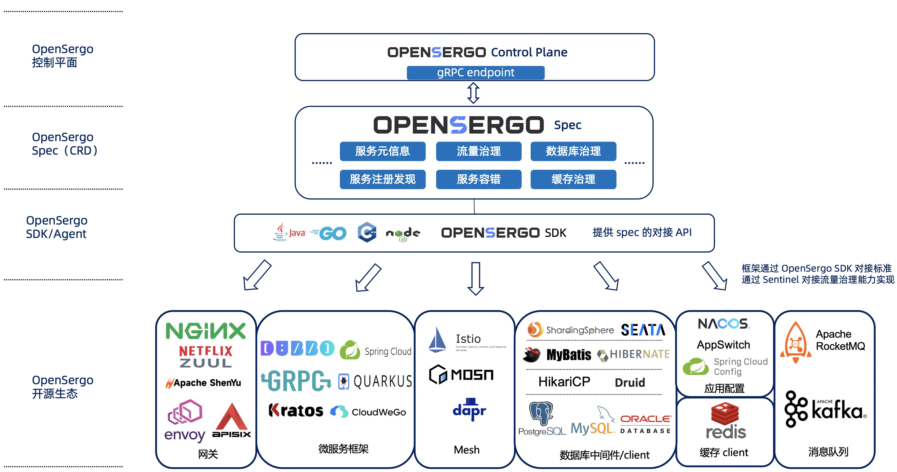

# OpenSergo 架构

OpenSergo 主要包含以下几部分：

* **OpenSergo Spec**：Spec 以统一的一套配置/DSL 定义微服务治理规则与配置，确保开发者可以用同一套标准对不同框架、不同协议、不同语言的微服务架构进行统一治理管控。
* **OpenSergo SDK**：OpenSergo 多语言 SDK 提供统一的 OpenSergo 适配层，供各个开源框架/组件接入到 OpenSergo 生态中。
* **OpenSergo 控制面**：OpenSergo 提供 Control Plane 作为 OpenSergo CRD 的统一管控组件，承载配置转换与下发的职责。
* **数据面（各框架生态）** ：各个接入 OpenSergo 生态的微服务框架/组件，都可以通过统一的 OpenSergo CRD 进行服务治理管控。

