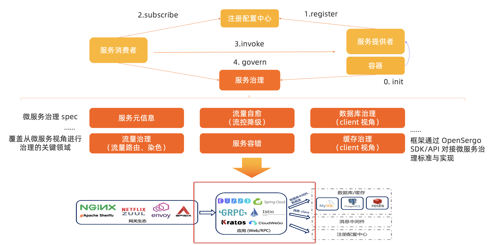
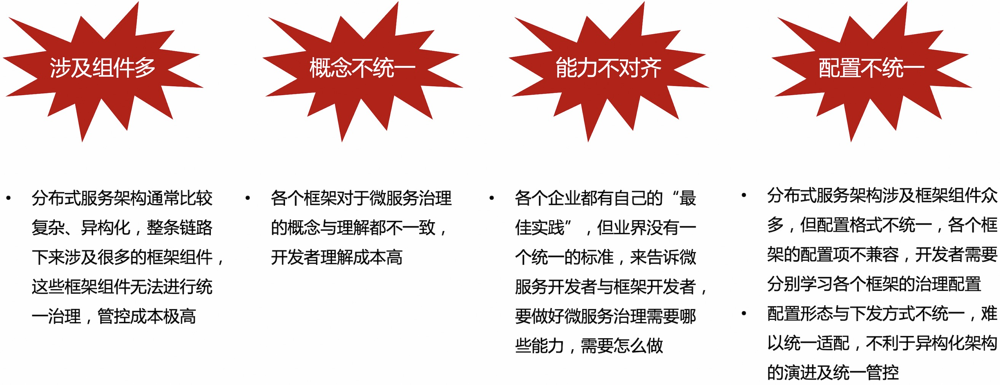

# 什么是 OpenSergo

OpenSergo 是开放通用的，覆盖微服务及上下游关联组件的微服务治理项目。OpenSergo 从微服务的角度出发，涵盖**流量治理、服务容错、服务元信息治理、安全治理**等关键治理领域，提供一系列的治理能力与标准、生态适配与最佳实践，支持 Java, Go, Rust 等多语言生态。OpenSergo 项目由阿里巴巴、bilibili、中国移动、SphereEx 等企业，以及 Kratos、CloudWeGo、ShardingSphere、Database Mesh、Spring Cloud Alibaba、Apache Dubbo 等社区联合发起，共同主导治理标准建设与能力演进。

OpenSergo 的最大特点就是**以统一的一套配置/DSL/协议定义服务治理规则，面向多语言异构化架构，覆盖微服务框架及上下游关联组件**。无论微服务的语言是 Java, Go, Node.js 还是其它语言，无论是标准微服务还是 Mesh 接入，从网关到微服务框架，从数据库到缓存访问，从服务注册发现到配置，开发者都可以通过同一套 OpenSergo CRD 标准配置进行统一的治理管控，而无需关注各框架、语言的差异点，降低异构化、全链路微服务治理管控的复杂度。

## 为什么需要 OpenSergo？

业界微服务治理存在着以下的问题：

* 涉及组件多：分布式服务架构通常比较复杂、异构化，整条链路下来涉及很多的框架组件，这些框架组件无法进行统一治理，管控成本极高。
* 概念不统一：各个框架对于微服务治理的概念与理解都不一致，开发者理解成本高。
* 能力不对齐：各个企业都有自己的“最佳实践”，但业界没有一个统一的标准，来告诉微服务开发者与框架开发者，要做好微服务治理需要哪些能力，需要怎么做。
* 配置不统一：分布式服务架构涉及框架组件众多，但配置格式不统一，各个框架的配置项不兼容，开发者需要分别学习各个框架的治理配置；配置形态与下发方式不统一，难以统一适配，不利于异构化架构的演进及统一管控。

因此，社区共同发起了 OpenSergo 项目，旨在提供统一的微服务治理标准与参考实现，以解决上面提到的理解与统一管控复杂度的问题。